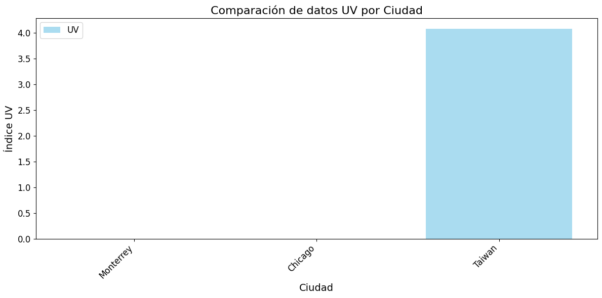
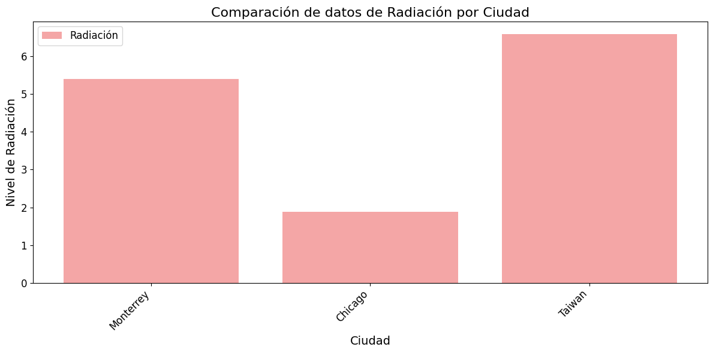
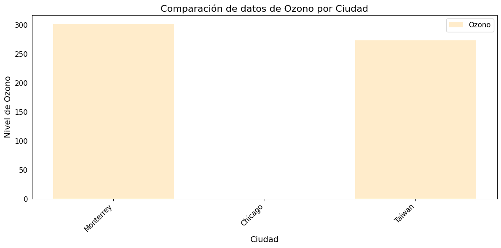

# UV Monitor — Consulta de Índice UV, Radiación y Ozono por Ciudad

Aplicación de consola en Python que permite consultar en tiempo real el **índice UV**, **nivel de radiación solar** y **capa de ozono** de cualquier ciudad del mundo, con exportación de datos a Excel y generación de gráficas comparativas.

---

## Capturas

### Índice UV por Ciudad


### Nivel de Radiación Solar


### Capa de Ozono


---

## Funcionalidades

- 🔍 **Búsqueda por ciudad** — Geolocalización automática usando `geopy`
- ☀️ **Índice UV en tiempo real** — Consulta a la API de OpenUV
- 📡 **Radiación solar** — Nivel máximo UV del día
- 🌿 **Capa de ozono** — Medición en unidades Dobson
- 📊 **Gráficas comparativas** — Visualización con `matplotlib` de múltiples ciudades
- 📁 **Exportación a Excel** — Tabla formateada con resaltado de valores máximos
- 💾 **Guardado en `.txt`** — Registro de ciudades consultadas

---

## 🛠️ Tecnologías

| Tecnología | Uso |
|---|---|
| Python 3 | Lenguaje principal |
| [OpenUV API](https://www.openuv.io/) | Datos de UV, radiación y ozono |
| `requests` | Peticiones HTTP a la API |
| `geopy` | Geocodificación de ciudades |
| `matplotlib` | Generación de gráficas |
| `pandas` | Manejo de datos |
| `openpyxl` | Exportación a Excel |

---

## ⚙️ Instalación

### 1. Clonar el repositorio

```bash
git clone https://github.com/Cesarozg/uv-monitor.git
cd uv-monitor
```

### 2. Instalar dependencias

```bash
pip install -r requirements.txt
```

### 3. Configurar API Key

Crea un archivo `.env` en la raíz del proyecto:

```
OPENUV_API_KEY=tu_api_key_aqui
```

> Puedes obtener una API key gratuita en [openuv.io](https://www.openuv.io/)

### 4. Ejecutar

```bash
python main.py
```

---

## Estructura del Proyecto

```
uv-monitor/
│
├── main.py                  # Punto de entrada
├── requirements.txt         # Dependencias
├── .env                     # API Key (NO subir a GitHub)
├── .gitignore
│
├── modulos/
│   ├── menu.py              # Menú interactivo principal
│   ├── datos.py             # Conexión con la API de OpenUV
│   ├── datosuv.py           # Módulo de índice UV
│   ├── radiacion.py         # Módulo de radiación solar
│   ├── ozono.py             # Módulo de capa de ozono
│   ├── excel.py             # Exportación a Excel
│   └── graficas.py          # Generación de gráficas
│
└── graficas/
    ├── grafico_uv.png
    ├── grafico_radiacion.png
    └── grafico_ozono.png
```

---

## Uso

Al ejecutar el programa, aparece un menú interactivo:

```
Bienvenido al menú:
1. Ingresar una ciudad
2. Consultar datos UV
3. Consultar Indicios de radiación
4. Consultar Nivel de Ozono
5. Salir
```

1. Ingresa primero una ciudad (opción 1)
2. Consulta cualquier dato (opciones 2, 3 o 4)
3. Elige si guardar los datos de esa ciudad
4. Repite con otras ciudades para comparar
5. Al salir, se generan automáticamente las gráficas y el archivo Excel

---

## Ejemplo de salida

```
Datos de radiación ultravioleta para la ciudad de: Monterrey
Índice UltraVioletas en la ciudad que indicaste: 5.39

Nivel de radiación Monterrey: 5.39
Capa de ozono en Monterrey: 301.8
```
